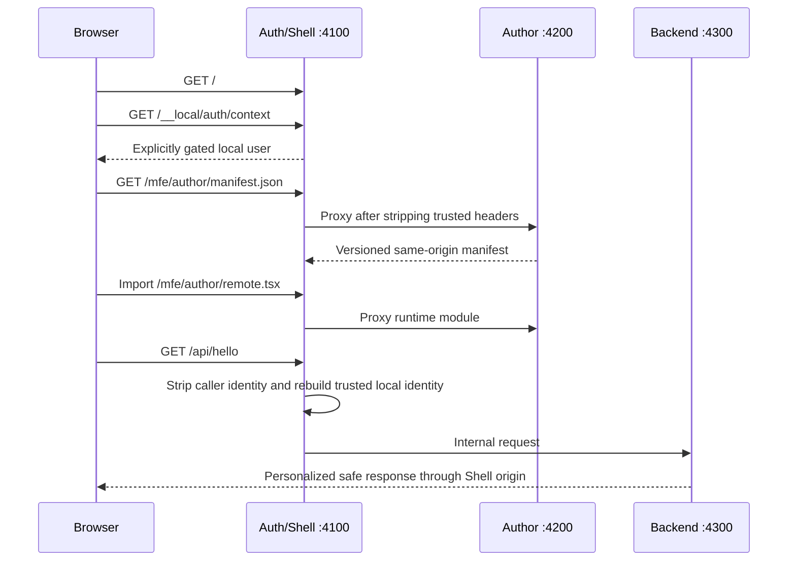

# Stage 0 local vertical slice

## Runtime flow

## Local ports

| Boundary | Direct development port | Browser-visible path |
|---|---:|---|
| Auth/Shell | 4100 | `/` |
| Author | 4200 | `/mfe/author/*` through Auth/Shell |
| Backend | 4300 | `/api/*` through Auth/Shell |

Browser code uses only `http://127.0.0.1:4100`. Direct ports exist only for local process
orchestration and smoke validation.

## Security invariants

- The local mock user exists only when both `ACA_ENVIRONMENT=local` and
  `LOCAL_DEV_AUTH_ENABLED=true`.
- Starting the local stack with any non-local environment value fails before serving traffic.
- Auth/Shell strips authorization and trusted identity headers supplied by the browser and
  recreates only `x-aca-user-name` from server-side local state.
- Author manifests must use the expected schema, contract version, and root-relative entry.
- Auth/Shell remains available and provides safe fallback behavior when Author or Backend stops.
- Error responses contain no stack traces or internal exception details.
