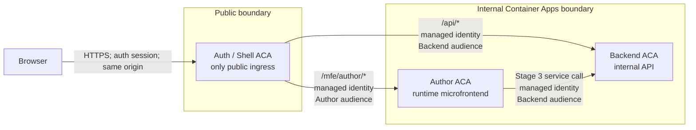

# Trust boundaries

## Invariants

- Only Auth/Shell is publicly reachable.
- Protected browser traffic remains on the Auth/Shell origin.
- No public environment route targets Author or Backend.
- Author and Backend validate distinct intended audiences and authorized callers.
- Trusted identity and proxy headers are stripped and recreated from trusted state.
- Authorization is server-side; hidden UI is not authorization.
- Local credentials are disabled unless an explicit local-only gate is active.
